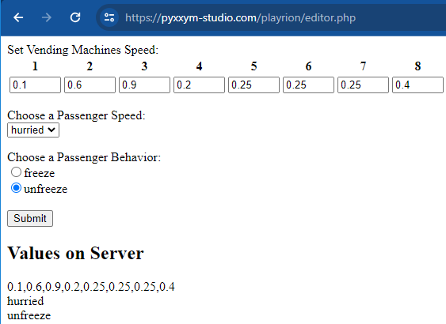

### Introduction
This is a Full-stack (Unity + backend) assessement for Playrion, received in 2023.
For the full description, see the PDF in the project (Playrion Technical Test - Fullstack programmer.pdf)

### Game
 Passenger's Finite State Machine uses Unity Mechanim.  On the gameObject, we have one Mechanim for the logic, one for the animation

Roughly the Passenger class has 7 differents states:
- search for available machine (if not found, retry after a while)
- go to machine
- wait & advance in line
- buying ticket (time differs depending on each different machine )
- go through gate to the train
- board on train
- and a last one : missed train !

 NavMesh is used for pathfinding. The station has a NavMeshSurface, machines have NavMeshObstacle and the passengers use NavMeshAgent.

### Backend
You can change machines speed, characters speed and character behavior with an HTML interface, by going to [https://pyxxym-studio.com/playrion/editor.php](https://pyxxym-studio.com/playrion/editor.php)

The interface is intuitive and does not need any further explanation, just know that the validity of the machine values is not checked! You must therefore enter numbers (numeric + optional decimal separation point) and not anything else, otherwise you will see strange behavior.

The values are saved when you press the SUBMIT button.

On the Client side (Unity), the game will read the values **every second**. These are the **saved values** that are transmitted. They are displayed at the bottom of the page for comparison with the values currently being edited.

The source code in PHP is in Backend/, up to you to deploy on other server. Don't forget to modify the server address in Unity (BackEndManager.cs).